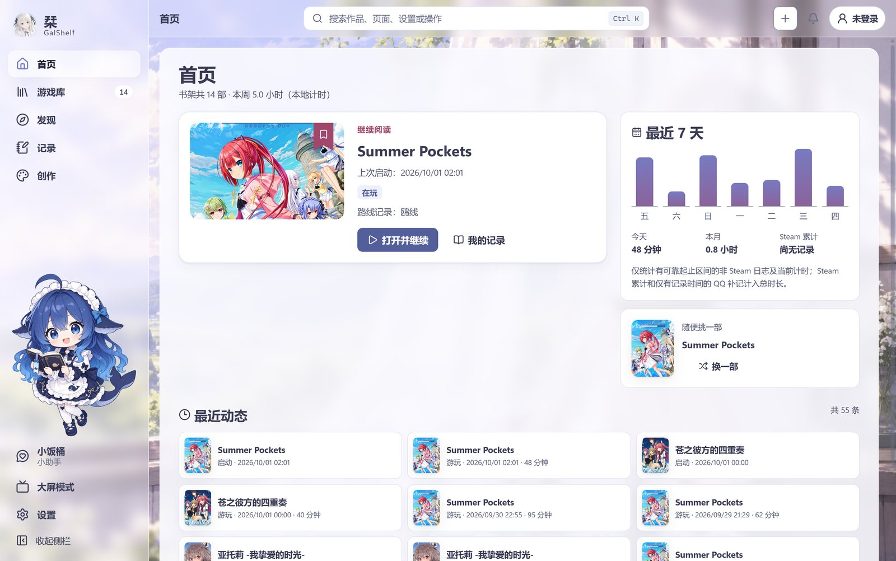
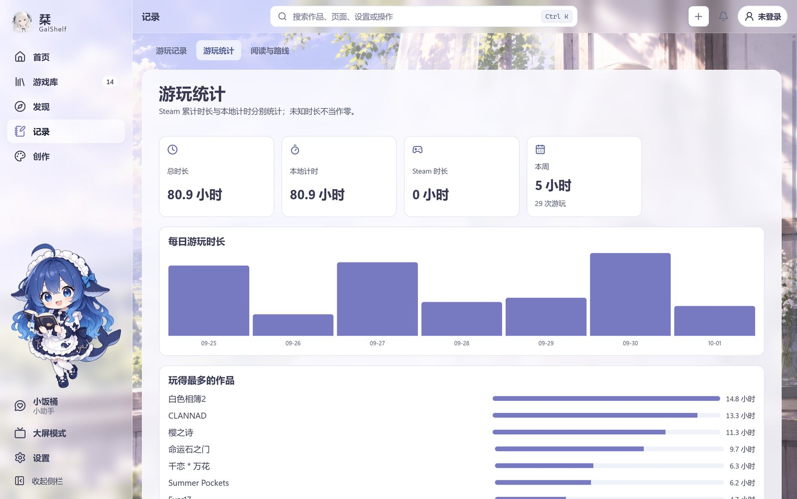
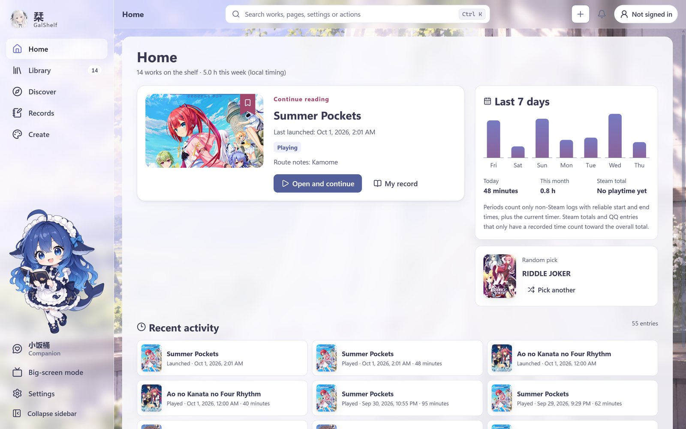
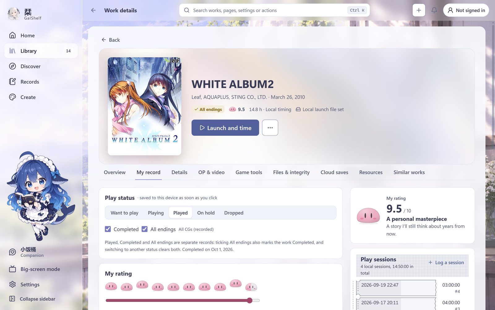
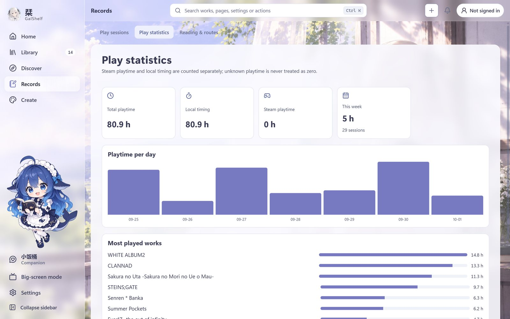

<a id="chinese"></a>

<!-- galshelf-releases: curated README (zh-CN). -->
<div align="center">


# 栞 · GalShelf

**为每一个故事，留一枚书签。**

一座属于你的 Galgame 书架　·　Windows 桌面客户端　·　本地优先

<sub>✦ 新图标将随之后的更新来到客户端 ✦</sub>

<br>

<a href="https://github.com/Harihi86/galshelf-releases/releases/latest"><b>▶ 开始游戏</b></a>
　｜　<a href="#-读取存档安装"><b>📂 读取存档</b></a>
　｜　<a href="#-系统设定更新与校验"><b>⚙ 系统设定</b></a>
　｜　<a href="https://galshelf.com"><b>✦ 官方网站</b></a>
　｜　<a href="#english"><b>🌐 English</b></a>

</div>

<br>

> **【栞】**
>
> 「欢迎回来。你上次停在《Summer Pockets》第三章——还说今晚要把鸥线推完呢。<br>
> 　游戏、时长、评分和那句没写完的进度，都替你好好收着哦。」
>
> <div align="right"><sub>▼</sub></div>

---

## ◆ 序章　什么是「栞」

**栞（しおり）** 是书签的意思。GalShelf 是写给 Galgame / 视觉小说玩家的 Windows 书架：
把硬盘里的游戏、想玩的新作、通关后的回忆收进同一个地方——启动就计时，给作品打上团子评分，
写下一句话进度，截图做成分享卡，换一台电脑也能接着读。

不需要账号也能使用；账号、Steam、云存档和网页书架都是可以之后再连接的选项。
界面支持简体中文与 English。

---

## ◆ 共通线　每天都会用到的功能

| 路线 | 内容 |
| :-- | :-- |
| 📚 **书架** | 扫描游戏文件夹或本机 Steam 游戏导入，确认匹配后才加入；按会社、收藏夹或 Steam 系列分组；标题、别名、原名、会社与 VNDB 编号都能即时搜索。 |
| ⏱ **计时与票根簿** | 从栞启动即自动计时，一次游玩一张票根；首页的最近 7 天图表和游玩统计，记下你陪伴每个故事的时间。 |
| 🍡 **团子评分与通关记录** | 0–10 的团子评分，「已通关 / 全结局 / 全 CG」标记和一句话短评。 |
| 🔖 **阅读与路线** | 一句话进度 + 下一步目标，打开就知道上次读到哪、接下来去哪条线。 |
| 🎮 **大屏模式** | 为电视和手柄重新设计：方向键与摇杆移动焦点，窝在沙发上也能挑下一部。 |
| 🖼 **截图与分享卡** | 游戏中按 <kbd>Ctrl</kbd>+<kbd>Alt</kbd>+<kbd>G</kbd> 打开游戏菜单截图，编辑后做成分享卡导出。 |
| 🛠 **游戏工具** | 转区启动（Locale Emulator）、Magpie 画面缩放、按作品的窗口设置、手柄映射键盘。 |
| 🌸 **小助手** | 陪在左下角的看板角色，可以换形象、调大小，也可以完全关闭。 |
| 🎨 **两套界面与背景** | A「经典氛围」与 B「整合版式」随时切换；背景支持图片、GIF 与 MP4 视频，作品页还能播放 OP。 |
| 🗓 **发售月历** | 区分 VNDB 已确认的发售日与尚未确认的消息，关注的会社新作不会错过。 |
| 🔍 **作品识别** | 以 VNDB 作品编号为准，用文件的 SHA-256 指纹辨认作品，只在值得注意时轻轻提醒。 |
| 🛡 **GalShelf Guard** | 可选的安全伴侣：记录可信文件清单，发现被修改的程序文件，可疑文件可隔离、可修复。 |
| ☁ **云存档** | 开启后自动备份与恢复已关联 VNDB 作品的存档（云端位置为同步文件夹，可选端到端加密）；提供「立即同步 / 上传备份 / 下载与恢复」。 |
| 🔄 **网页书架** | 在 [galshelf.com](https://galshelf.com) 使用 GalShelf 账号，网页与客户端按字段同步书架记录。 |

---

## ◆ CG 鉴赏

> [!NOTE]
> **以下截图均为演示（Demo）。** 画面来自当前发布的 0.2.6 客户端；书架上是真实的 Galgame 作品，
> 但评分、游玩时长、进度、短评等全部是为展示界面而虚构的数据，不属于任何真实用户。

<table>
<tr>
<td width="50%" align="center"><a href="assets/screenshots/zh-CN/home.jpg"></a><br><sub><b>首页</b>　继续上次的故事，最近 7 天一目了然</sub></td>
<td width="50%" align="center"><a href="assets/screenshots/zh-CN/library.jpg"></a><br><sub><b>游戏库</b>　封面墙、状态筛选与分组</sub></td>
</tr>
<tr>
<td align="center"><a href="assets/screenshots/zh-CN/my-record.jpg"></a><br><sub><b>我的记录</b>　团子评分、通关标记与游玩票根</sub></td>
<td align="center"><a href="assets/screenshots/zh-CN/reading.jpg"></a><br><sub><b>阅读与路线</b>　一句话进度和下一步目标</sub></td>
</tr>
<tr>
<td align="center"><a href="assets/screenshots/zh-CN/statistics.jpg"></a><br><sub><b>游玩统计</b>　每日时长与玩得最多的作品</sub></td>
<td align="center"><a href="assets/screenshots/zh-CN/big-picture.jpg"></a><br><sub><b>大屏模式</b>　拿起手柄，从沙发上开始</sub></td>
</tr>
</table>

---

## ◆ 读取存档｜安装

**需要**：Windows 10 / 11（64 位），以及 Microsoft Edge WebView2 Runtime（Windows 11 通常已自带）。
不需要 Python、Node.js 或管理员权限。

1. 在 [Releases](https://github.com/Harihi86/galshelf-releases/releases/latest) 下载 `GalShelf-Windows-<版本>.zip`。
2. 把**整个** ZIP 解压到一个新文件夹，让 `components` 文件夹（aria2、Magpie、Locale Emulator）和 `GalShelf.exe` 放在一起。
3. 运行 `GalShelf.exe`，跟着首次启动的引导走一遍就好。

> [!TIP]
> 栞没有安装程序，程序也未做代码签名，Windows SmartScreen 可能会请你确认一次。
> 你的书架、设置和记录保存在 `%LOCALAPPDATA%\GalShelf`，不在程序文件夹里——
> 升级时可以把新版本解压到新文件夹，确认没问题再删掉旧的，两边读取的是同一份数据。

---

## ◆ 系统设定｜更新与校验

- 客户端会在应用内检查更新：它读取本仓库 stable 频道的 `stable/latest.json`（签名清单）与 `stable/latest.json.sig`（分离签名）。
- 只有清单签名、安装包大小和 SHA-256 **全部一致**时才会安装更新。
- `releases/v<版本>/` 保存每个已发布版本的清单、校验值和更新说明。
- 更新清单使用以下公钥签名（Ed25519，base64）：

```
galshelf-update-2026-09: II1VyOQWGZphhHvY0bcjvqpuYkb1UjBmzb75h+VfuQc=
```

想自己核对下载的安装包，可以在 PowerShell 中运行，并与同一 Release 里的 `SHA256SUMS.txt` 对照：

```powershell
Get-FileHash .\GalShelf-Windows-<版本>.zip -Algorithm SHA256
```

---

## ◆ 回想｜版本记录

每个版本的更新说明都在 [Releases](https://github.com/Harihi86/galshelf-releases/releases) 页面，
也保存在 [`releases/`](releases/) 目录中。使用说明与常见问题见 [galshelf.com/docs](https://galshelf.com/docs)。

---

## ◆ STAFF｜特别感谢

- 作品资料与封面来自 [VNDB](https://vndb.org) 等公开资料库。
- 安装包随附的第三方组件各自遵循其许可证：[aria2](https://github.com/aria2/aria2)（GPL-2.0）、
  [Magpie](https://github.com/Blinue/Magpie)（GPL-3.0）、[Locale Emulator](https://github.com/xupefei/Locale-Emulator)（LGPL-3.0）。

<br>

> **【栞】**
>
> 「新的图标，会在之后的更新里和你见面。<br>
> 　那么——下一个故事，也请多指教。」
>
> <div align="right"><sub>～ FIN ～</sub></div>

<sub>截图中出现的游戏名称与封面，版权归各自的权利人所有，仅用于展示软件界面。</sub>

---

<a id="english"></a>

## English

<!-- galshelf-releases: curated README (en). -->
<div align="center">


# 栞 · GalShelf

**A bookmark for every story.**

Your own galgame bookshelf　·　Windows desktop app　·　local-first

<sub>✦ The new icon arrives in the app with an upcoming update ✦</sub>

<br>

<a href="https://github.com/Harihi86/galshelf-releases/releases/latest"><b>▶ START</b></a>
　｜　<a href="#-load-game--install"><b>📂 LOAD</b></a>
　｜　<a href="#-config--updates-and-verification"><b>⚙ CONFIG</b></a>
　｜　<a href="https://galshelf.com"><b>✦ WEBSITE</b></a>
　｜　<a href="#chinese"><b>🌐 简体中文</b></a>

</div>

<br>

> **【Shiori】**
>
> “Welcome back. You stopped at chapter 3 of *Summer Pockets* — and you said you'd finish Kamome's route tonight.<br>
> 　Your games, your playtime, your ratings and that half-written note — I kept them all safe for you.”
>
> <div align="right"><sub>▼</sub></div>

---

## ◆ Prologue · What is GalShelf?

**栞 (shiori)** means *bookmark*. GalShelf is a Windows bookshelf made for people who play galgames and visual novels.
It keeps the games on your drive, the new releases you're waiting for and the memories of every ending in one place:
it times your sessions when you launch from it, lets you rate works with dango, remembers where you stopped in one line,
turns screenshots into share cards, and lets you pick up the story on another PC.

No account is needed; accounts, Steam, cloud saves and the web shelf are optional and can be connected later.
The interface is available in Simplified Chinese and English.

---

## ◆ Common Route · What you'll use every day

| Route | What it does |
| :-- | :-- |
| 📚 **Shelf** | Import by scanning a games folder or the Steam games on this PC; nothing is added until you confirm the matches. Group by company, collection or Steam series; instant search over titles, aliases, original titles, companies and VNDB ids. |
| ⏱ **Timer & play stubs** | Launch a game from GalShelf and it is timed automatically — one stub per session. The home page's last-7-days chart and the statistics show how long you spent with each story. |
| 🍡 **Dango rating & completion** | Rate from 0 to 10 in dango, mark *Completed / All endings / All CGs*, and leave a one-line review. |
| 🔖 **Reading & routes** | A one-line note of where you stopped and your next goal, so you always know which route comes next. |
| 🎮 **Big Picture** | Redesigned for TVs and controllers: move focus with the d-pad or stick and pick the next story from the couch. |
| 🖼 **Screenshots & share cards** | Press <kbd>Ctrl</kbd>+<kbd>Alt</kbd>+<kbd>G</kbd> in game to open the game menu, take a screenshot, edit it and turn it into a share card. |
| 🛠 **Game tools** | Locale-emulated launch (Locale Emulator), Magpie scaling, per-work window settings and controller-to-keyboard mapping. |
| 🌸 **Companion** | A companion character in the lower-left corner: change her look or size, or turn her off completely. |
| 🎨 **Two layouts & backgrounds** | Switch between A “Classic atmosphere” and B “Integrated layout”; backgrounds can be images, GIFs or MP4 videos, and work pages can play the OP. |
| 🗓 **Release calendar** | Tells VNDB-confirmed release dates apart from unconfirmed announcements, so new titles from the companies you follow don't slip by. |
| 🔍 **Work identification** | Anchored to the VNDB work id and SHA-256 file fingerprints, with quiet hints only when something deserves your attention. |
| 🛡 **GalShelf Guard** | An optional security companion: records a trusted file list per game, spots modified program files, and can quarantine or repair suspicious files. |
| ☁ **Cloud saves** | Once turned on, saves of VNDB-linked works are backed up and restored automatically to a sync folder, with optional end-to-end encryption; *Sync now*, *Upload backup* and *Download / restore* are one click away. |
| 🔄 **Web shelf** | Use a GalShelf account on [galshelf.com](https://galshelf.com); the web shelf and the desktop app sync your records field by field. |

---

## ◆ CG Gallery

> [!NOTE]
> **All screenshots below are a demo.** They were taken with the currently released GalShelf 0.2.6. The shelf holds
> real galgames, but every rating, playtime, progress note and review was made up to show the interface — none of it
> belongs to a real user.

<table>
<tr>
<td width="50%" align="center"><a href="assets/screenshots/en/home.jpg"></a><br><sub><b>Home</b> — continue the last story; the past week at a glance</sub></td>
<td width="50%" align="center"><a href="assets/screenshots/en/library.jpg"></a><br><sub><b>Library</b> — cover wall, status filters and grouping</sub></td>
</tr>
<tr>
<td align="center"><a href="assets/screenshots/en/my-record.jpg"></a><br><sub><b>My record</b> — dango rating, completion marks and play stubs</sub></td>
<td align="center"><a href="assets/screenshots/en/reading.jpg"></a><br><sub><b>Reading & routes</b> — where you stopped and what's next</sub></td>
</tr>
<tr>
<td align="center"><a href="assets/screenshots/en/statistics.jpg"></a><br><sub><b>Play statistics</b> — daily playtime and your most-played works</sub></td>
<td align="center"><a href="assets/screenshots/en/big-picture.jpg"></a><br><sub><b>Big Picture</b> — grab a controller and start from the couch</sub></td>
</tr>
</table>

---

## ◆ Load Game · Install

**You need** Windows 10 or 11 (64-bit) and the Microsoft Edge WebView2 Runtime (Windows 11 usually has it).
No Python, Node.js or administrator rights are required.

1. Download `GalShelf-Windows-<version>.zip` from the [latest release](https://github.com/Harihi86/galshelf-releases/releases/latest).
2. Extract the **whole** ZIP into a new folder and keep the `components` folder (aria2, Magpie, Locale Emulator) next to `GalShelf.exe`.
3. Start `GalShelf.exe` and follow the welcome tour.

> [!TIP]
> GalShelf has no installer and the executable is not code-signed, so Windows SmartScreen may ask you to confirm once.
> Your shelf, settings and records live in `%LOCALAPPDATA%\GalShelf`, not in the program folder — to upgrade, extract
> the new version into a new folder and remove the old one once you're happy; both read the same data.

---

## ◆ Config · Updates and verification

- The app checks for updates in-app by reading this repository's stable channel: `stable/latest.json` (the signed update manifest) and `stable/latest.json.sig` (its detached Ed25519 signature).
- An update is installed only when the manifest signature, the package size and its SHA-256 **all** match.
- `releases/v<version>/` keeps the manifest, checksums and release notes of every published version.
- Update manifests are signed with this public key (Ed25519, base64):

```
galshelf-update-2026-09: II1VyOQWGZphhHvY0bcjvqpuYkb1UjBmzb75h+VfuQc=
```

To check a download yourself, run this in PowerShell and compare the result with `SHA256SUMS.txt` in the same release:

```powershell
Get-FileHash .\GalShelf-Windows-<version>.zip -Algorithm SHA256
```

---

## ◆ Recollection · Release history

Release notes for every version are on the [Releases](https://github.com/Harihi86/galshelf-releases/releases) page
and in the [`releases/`](releases/) folder. Guides and FAQs live at [galshelf.com/docs](https://galshelf.com/docs).

---

## ◆ Staff · Special thanks

- Work details and covers come from public databases such as [VNDB](https://vndb.org).
- Third-party components shipped in the package keep their own licenses: [aria2](https://github.com/aria2/aria2) (GPL-2.0),
  [Magpie](https://github.com/Blinue/Magpie) (GPL-3.0) and [Locale Emulator](https://github.com/xupefei/Locale-Emulator) (LGPL-3.0).

<br>

> **【Shiori】**
>
> “The new icon will come to see you in an upcoming update.<br>
> 　Until then — here's to the next story.”
>
> <div align="right"><sub>～ FIN ～</sub></div>

<sub>Game titles and cover art shown in the screenshots belong to their respective owners and appear only to show the software's interface.</sub>
