<!-- galshelf-releases: curated README (zh-CN first, English below). -->
<a id="chinese"></a>

> [!IMPORTANT]
> **灰度测试与开源计划**：GalShelf 当前版本仍处于灰度测试阶段，功能、界面和内部实现仍在进行大幅更新修改，因此暂不开放源代码。待稳定版发布后，将正式开放源代码；具体安排会在本仓库公布。
>
> 详见下方的[开源说明](#zh-open-source)。

<div align="center">


# 栞 · GalShelf

**为每一个故事，留一枚书签。**

写给 Galgame / 视觉小说玩家的 Windows 书架：<br>
把游戏整理好，在游戏里截图、识别台词，把玩过的故事记下来，再做成一张分享卡。

<a href="https://github.com/Harihi-Works/GalShelf-Dev/releases/latest"><b>⬇ 下载最新版</b></a>
　·　<a href="#zh-install"><b>安装</b></a>
　·　<a href="#zh-updates"><b>更新与校验</b></a>
　·　<a href="#zh-companions"><b>配套工具</b></a>
　·　<a href="https://galshelf.com"><b>官方网站</b></a>
　·　<a href="#english"><b>🌐 English</b></a>

<sub>当前灰度测试版本 0.2.7　·　Windows 10 / 11（64 位）　·　本地使用无需账号；同步功能可选　·　简体中文 / English</sub>

</div>

<br>

<a href="assets/screenshots/zh-CN/library.jpg">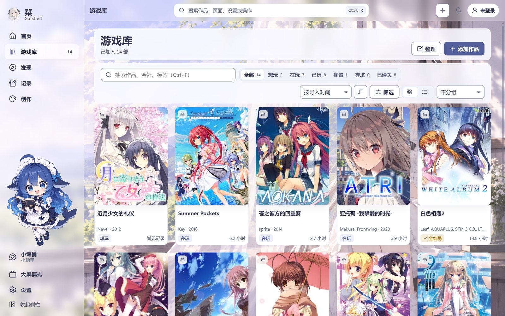</a>

> [!NOTE]
> **版本与截图**　当前发布版本为 [GalShelf 0.2.7](https://github.com/Harihi-Works/GalShelf-Dev/releases/tag/v0.2.7)。以下保留 0.2.6 的功能介绍与演示截图，版本限定的操作和限制按该版本阅读；最新界面与改动请结合 0.2.7 发布说明查看。
>
> **关于截图**　全部画面都来自已发布的 **GalShelf 0.2.6** 客户端，使用一份独立的演示数据：作品名称与封面来自公开资料库，状态、评分、游玩时长、票根、短评和阅读笔记都是为演示编写的，不属于任何真实用户。
>
> 截图时「插画程度」设为「不显示」，所以没有小助手立绘，左下角的小助手入口照常可用。游戏内的画面是用 GalShelf 自带插画制作的演示窗口，不是任何商业游戏的画面；游戏菜单一图由演示窗口和游戏菜单窗口两张真实截图，按屏幕上的实际位置拼合在纯色背景上,因此会出现作品重叠的情况，但正常使用中不会有该情况。

---

## 📚 书架：把硬盘里的游戏收拾好

选一个游戏文件夹，栞会把每个子文件夹和 VNDB 等资料源比对（只发送作品名称），标出**高置信**、**需核对**和**未识别**，列出候选作品与游戏主程序——你确认之前，什么都不会写入书架。也可以导入本机 Steam 里的游戏，或者手动添加，除此之外，即使没有名字也不要紧，未来即将支持作品指纹识别，轻松导入游戏

收好之后，按状态筛选，按会社、收藏夹或 Steam 系列分组，标题、原名、会社都能即时搜到。打开「整理」，一次选中几部，批量修改状态、加入收藏夹或移入回收站。

<table>
<tr>
<td width="50%"><a href="assets/screenshots/zh-CN/import.jpg">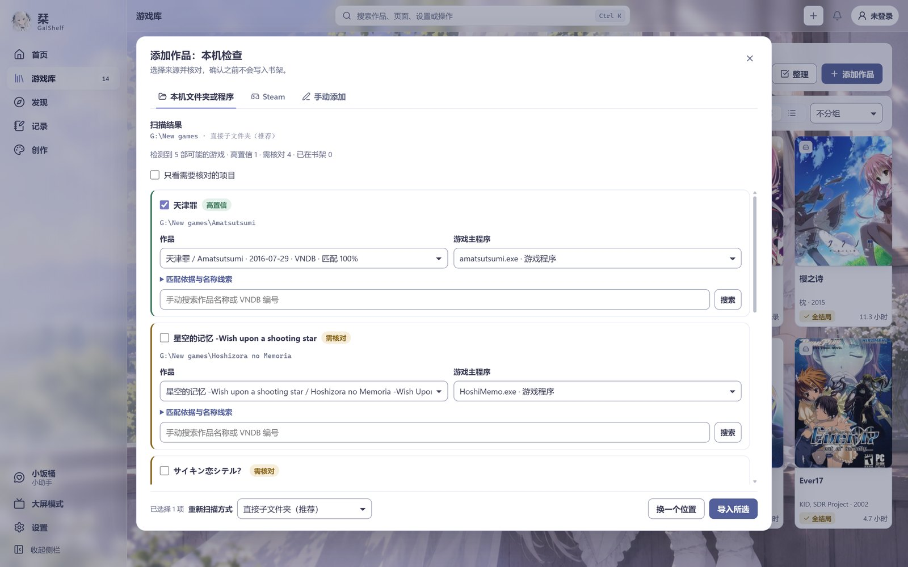</a></td>
<td width="50%"><a href="assets/screenshots/zh-CN/organize.jpg">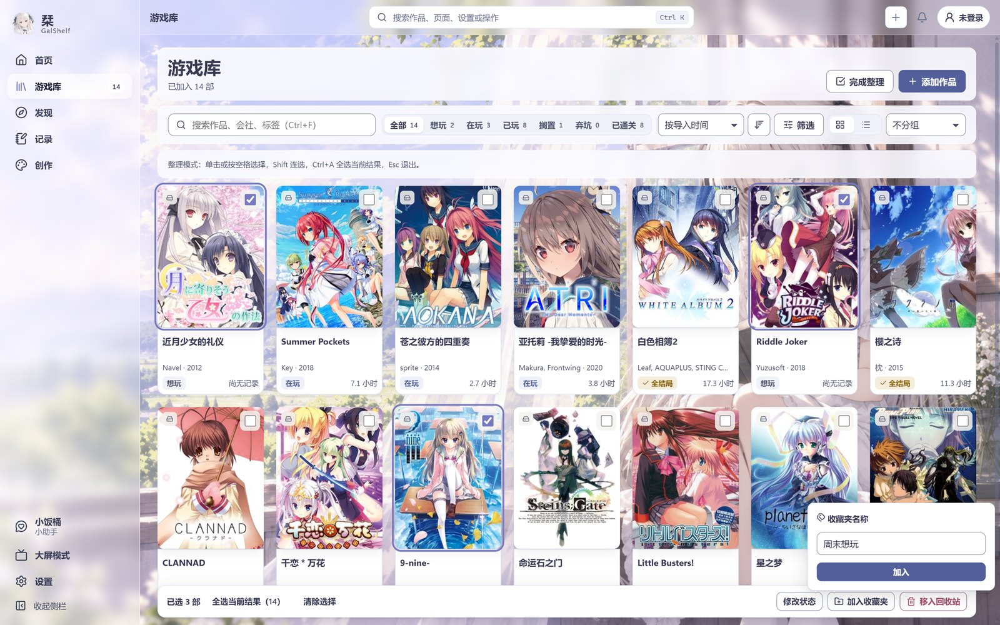</a></td>
</tr>
<tr>
<td><sub><b>导入前先核对</b>　扫描出五个文件夹：一个高置信，其余四个等你确认作品和主程序。</sub></td>
<td><sub><b>整理模式</b>　选中三部作品，准备一起放进新收藏夹「周末想玩」。</sub></td>
</tr>
</table>

## 🎮 游戏中：不必切出游戏

从栞启动游戏就会自动计时。游戏运行时按 <kbd>Ctrl</kbd>+<kbd>Alt</kbd>+<kbd>G</kbd>（可在设置中更改），游戏菜单会出现在游戏窗口旁边：截图和截图历史、窗口透明度与置顶、Magpie 画面缩放、手柄映射键盘，以及计时方式，都在这里。

截图会冻结当前画面，并直接在游戏窗口上打开编辑器：裁剪、打码、超分、擦除与抠图，还能用 Windows 自带的 OCR 在本机识别台词。识别可能出错，校对后点「确认台词」，这张截图和这句台词就能一起交给分享卡。

<a href="assets/screenshots/zh-CN/game-menu.jpg">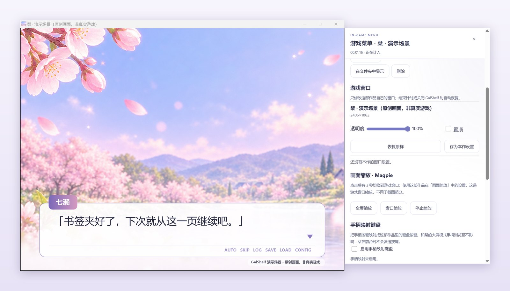</a>

<sub><b>游戏菜单</b>　计时中的演示场景旁边，就是 0.2.6 的游戏菜单：窗口透明度与置顶、Magpie 画面缩放、手柄映射键盘；往上翻是截图与截图历史。</sub>

<table>
<tr>
<td width="50%"><a href="assets/screenshots/zh-CN/screenshot-editor.jpg">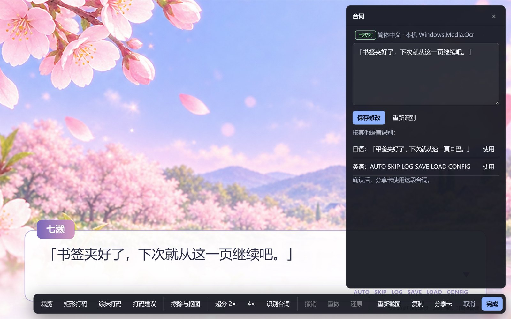</a></td>
<td width="50%"><a href="assets/screenshots/zh-CN/share-card-dialogue.jpg"></a></td>
</tr>
<tr>
<td><sub><b>截图编辑器</b>　识别出的台词校对后标为「已校对」，工具栏里是裁剪、打码、超分等工具。</sub></td>
<td><sub><b>交给分享卡</b>　截图与台词自动排进横版对白卡，角色名和对白都能再改。</sub></td>
</tr>
</table>

<sub>在 0.2.6 中，游戏菜单和截图编辑器只有中文界面；分享卡上预设的文字（状态、评分评语、单位、寄语等）和图层名称也只有中文，作品名、短评和台词按你填写的显示。</sub>

## 🍡 记录：玩过的故事，都有迹可循

每部作品都有「我的记录」：游玩状态、已通关 / 全结局、0–10 分的团子评分、短评、路线与进度、私人手记。每次游玩留下一张票根，时长精确到秒；在别的电脑上玩了，也可以手动补记一次，票根上会注明「补记」。

「阅读与路线」把正在读和正在重温的作品放在一起：一句话进度、下一步打算，以及最近一次从哪个入口启动。隔几天再回来，也知道从哪里接着读。

<table>
<tr>
<td width="50%"><a href="assets/screenshots/zh-CN/record.jpg"></a></td>
<td width="50%"><a href="assets/screenshots/zh-CN/reading.jpg">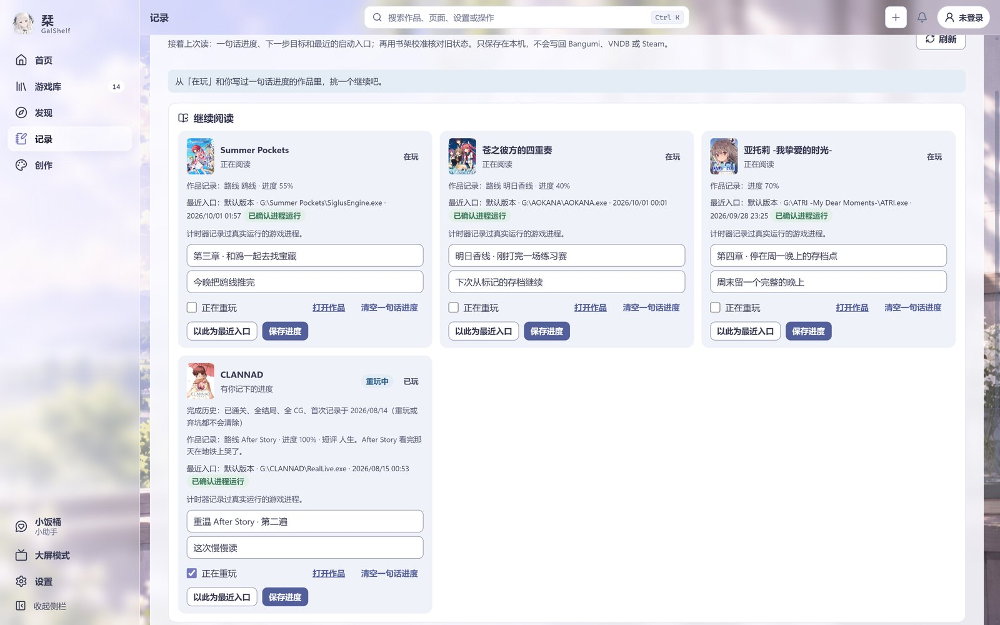</a></td>
</tr>
<tr>
<td><sub><b>我的记录</b>　《白色相簿2》：全结局、9.5 分，五张票根合计 17 小时 20 分，其中一张是补记。</sub></td>
<td><sub><b>阅读与路线</b>　三部在读、一部重温中，各自写着停在哪里、下一步做什么。</sub></td>
</tr>
</table>

## 🎴 分享卡：把喜欢的故事拿给别人看

分享卡直接读取你的记录——状态、团子评分、游玩时长、一句话短评——排进玻璃、侧栏、海报、票根、手帐等版式。卡上的每个元素都是图层，可以拖动、改字、换字体、隐藏、调整层次，最后导出 1400×1750 或 1600×1000 的 PNG。

<a href="assets/screenshots/zh-CN/share-card-ticket.jpg"></a>

<sub><b>票根版式</b>　卡上的全结局、9.5 分、17.3 小时和短评都来自同一份记录；右侧面板正在编辑左上角的手写寄语，模板自带的「角色签名」图层已隐藏。</sub>

## 📺 大屏模式

专为电视和手柄设计：用方向键或摇杆移动焦点，选中的作品可以直接查看详情或修改状态，上次玩的作品按一下就能继续。

<p align="center"><a href="assets/screenshots/zh-CN/big-picture.jpg">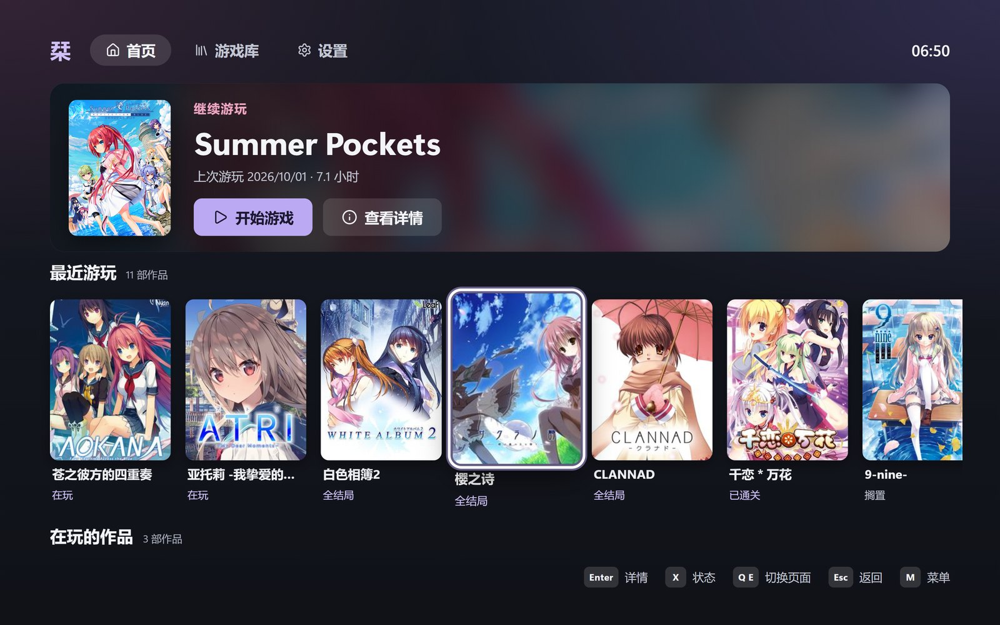</a></p>

---

## ✦ 更多功能

<details>
<summary><b>☁ 云存档与书架同步</b></summary>

<br>

云存档和书架同步是两件事：云存档备份的是**游戏存档文件**；书架同步只同步**作品记录**（状态、评分、通关与全结局、标签、短评、私人手记、每次游玩的日期与时长等）。

**云存档**
- 只对已关联 VNDB 作品编号的游戏生效，每部作品可以单独开关。在「设置 › 账号与同步」中开启一次后，确认过存档位置的作品会在启动前同步、退出后备份；可信且兼容的缺失存档会自动恢复。
- 作品页的云存档卡片有三个操作：「立即同步」按安全方向对比并同步；「上传备份」只保存这台电脑的进度；「下载 / 恢复」只恢复明确的云端版本，替换本地有改动的存档前会先确认，并保留本地安全快照。
- 两台电脑分别离线游玩产生分歧时，两份进度都会保留，由你选择继续哪一份；每部作品默认保留 10 个版本。
- **存放位置**：公开版可以选择一个同步文件夹（例如由网盘客户端同步的本地文件夹）。直接连接 Google Drive 与 OneDrive 的功能已经实现，但连接所需的应用注册没有随公开版提供，目前还不能直接连接这两项服务。
- 可选端到端加密；口令遗失后无法找回。不加密时，同步文件夹的安全程度取决于你的网盘与磁盘。开启云存档时，对话框里还有三个联网选项：在线查询指纹、贡献指纹、在仅自己可见的网站页面显示备份状态，都可以取消勾选。

**书架同步**
- 需要 [galshelf.com](https://galshelf.com) 账号，在「设置 › 账号与同步」中开启。网页书架与客户端按字段合并，离线修改会排队，冲突逐项选择。
- 同步不是备份：删除也会同步。游戏程序、文件夹、启动选项与存档不会上传；「阅读与路线」里的一句话进度和下一步只保存在本机。

</details>

<details>
<summary><b>🛡 GalShelf Guard 与作品识别</b></summary>

<br>

- **GalShelf Guard** 是可选的独立程序，目前是 0.1.0 预发布测试版：单独的安装程序，未做代码签名，安装时 Windows 可能请求管理员权限。可以在「设置 › 隐私与安全」中检查、下载、校验并安装。
- Guard 为每部已安装的作品记录可信文件清单，发现被修改、缺失或新增的程序文件，用自带规则分析；可疑文件可以移入可恢复的隔离区，也可以从已核验的本地副本修复。Microsoft Defender 只是可选的补充。
- **文件变化不等于中毒**：只有扫描器给出的结果才会被标记为威胁。不安装 Guard 时，客户端自己也会记录已确认的启动文件，在文件变化时提醒。
- **作品识别**以 VNDB 作品编号为准，按文件 SHA-256 与维护者签名的指纹数据集比对。身份匹配只说明文件属于哪部作品，不代表文件安全。首个维护者数据集尚未发布，所以 0.2.6 中还不会有来自数据集的识别结果。联网查询与贡献都是可选的，贡献与账号关联，并非匿名。

</details>

<details>
<summary><b>🛠 启动与游戏工具</b></summary>

<br>

- 作品页的「游戏工具」可以设置启动文件、转区启动（Locale Emulator，仅适用于 32 位程序）、Magpie 缩放与窗口设置；计时方式可选前台计时、进程计时或「前台 + 有操作」。
- 游戏菜单只对栞正在计时的游戏打开。截图保存在本机，编辑结果另存为新文件，不会改动原始截图。
- 识别台词使用 Windows 自带的 OCR，在本机完成，需要系统装有对应语言（中文、日文或英文）的 OCR 组件。

</details>

<details>
<summary><b>🎨 外观、发现与小助手</b></summary>

<br>

- 背景可以是图片、GIF 或 MP4 视频，可调整焦点、适配方式、透明度与模糊。作品页的「OP 与影像」可以播放或下载 OP、预告片，视频默认静音，游戏运行时自动暂停。
- 「发现」可以跨多个资料源搜索作品；发售月历区分 VNDB 已确认的日期与仅来自 NextMoe 的消息；相似作品推荐按系列、制作人员、开发商与题材排列。角色与生日需要在「设置 › 账号与同步」中关联 galbd；以图识图只在你点击开始后发送所选图片。
- 左下角的小助手可以更换形象、调整立绘大小，也可以在设置中完全关闭。

</details>

---

<a id="zh-companions"></a>

## 配套工具

围绕 GalShelf 的游戏管理与游玩体验，我们还维护以下配套工具。它们分别补充识别数据、文件检查和存档同步能力；GalShelf 本身就是本页介绍的主应用，不需要跳转到其他页面查看，也不要求安装全部配套工具。

| 配套工具 | 用途 | 文字介绍 |
| --- | --- | --- |
| **Galdex** | 面向维护者的作品指纹与存档规则采集、核验、审核和签名发布 | [指纹与规则维护](GALDEX.md#chinese) |
| **Galguard / GalShelf Guard** | 文件完整性检查、异常变化提示、可恢复隔离与经核验的本地修复 | [安全与完整性](GALGUARD.md#chinese) |
| **Galdrive** | 独立存档备份、版本管理、多设备同步、冲突处理与恢复保护 | [存档备份与同步](GALDRIVE.md#chinese) |

Galdex 与 Galdrive 的核心功能已基本完成。Galdex 仍为内部维护工具，Galdrive 的独立下载暂未开放；工具完成、数据覆盖和发布验收分别管理。上述分页均为纯文字介绍，不改变 GalShelf 已有云存档或现有下载状态。

---

<a id="zh-install"></a>

## ⬇ 安装

**需要**：Windows 10 / 11（64 位），以及 Microsoft Edge WebView2 Runtime（Windows 11 通常已自带）。不需要 Python、Node.js 或管理员权限。

1. 在 [Releases](https://github.com/Harihi-Works/GalShelf-Dev/releases/latest) 下载 `GalShelf-Windows-<版本>.zip`，请以所选 Release 的安装包和说明为准。
2. 把**整个** ZIP 解压到一个新文件夹，让 `components` 文件夹（aria2、Magpie、Locale Emulator、Real-ESRGAN）和 `GalShelf.exe` 放在一起。
3. 运行 `GalShelf.exe`，首次启动有中英双语的引导。

> [!TIP]
> 栞没有安装程序，程序也未做代码签名，Windows SmartScreen 可能会请你确认一次。
>
> 书架、设置和记录保存在 `%LOCALAPPDATA%\GalShelf`，不在程序文件夹里——升级时可以把新版本解压到新文件夹，确认没问题再删掉旧的，两边读取的是同一份数据。

<a id="zh-updates"></a>

## 🔏 更新与校验

- 客户端在应用内检查更新：它读取本仓库最新 Release 中的 `latest.json`（内含 Ed25519 签名的更新清单）。只有清单签名、安装包大小和 SHA-256 **全部一致**时才会安装更新；游戏运行时不会安装更新。
- `releases/v<版本>/` 保存每个已发布版本的清单、校验值和更新说明；`stable/latest.json` 是当前发布渠道的更新清单副本（`stable` 为渠道目录名，不代表当前版本已结束灰度测试），`stable/latest.json.sig` 是它的独立签名，供手动核对。
- 更新清单使用以下公钥签名（Ed25519，base64）：

```
galshelf-update-2026-09: II1VyOQWGZphhHvY0bcjvqpuYkb1UjBmzb75h+VfuQc=
```

想自己核对下载的安装包，可以在 PowerShell 中运行，并与同一 Release 里的 `SHA256SUMS.txt` 对照：

```powershell
Get-FileHash .\GalShelf-Windows-<版本>.zip -Algorithm SHA256
```

## 📜 版本记录

每个版本的更新说明都在 [Releases](https://github.com/Harihi-Works/GalShelf-Dev/releases) 页面，也保存在 [`releases/`](releases/) 目录中。使用说明与常见问题见 [galshelf.com/docs](https://galshelf.com/docs)。

<a id="zh-open-source"></a>

## 🔓 开源说明

- **当前阶段**：GalShelf 仍处于灰度测试与快速迭代中，项目自身的源代码暂不公开。本仓库目前用于发布说明、使用文档、截图、下载与更新校验信息；仓库公开不代表应用源代码已经开源。
- **后续计划**：待稳定版发布后开放源代码。源码发布地址、开源许可证及参与贡献的方式，将在正式开源时一并公布；目前尚未确定具体开源日期。
- **第三方组件**：随附的开源组件继续遵循各自的许可证，相关项目链接见下方「致谢与许可」。GalShelf 自身的源码开放计划不改变这些组件的许可条款。

## 💐 致谢与许可

- 作品资料与封面来自 [VNDB](https://vndb.org) 等公开资料库。
- 安装包随附的第三方组件各自遵循其许可证：[aria2](https://github.com/aria2/aria2)（GPL-2.0）、[Magpie](https://github.com/Blinue/Magpie)（GPL-3.0）、[Locale Emulator](https://github.com/xupefei/Locale-Emulator)（LGPL-3.0）、[Real-ESRGAN-ncnn-vulkan](https://github.com/xinntao/Real-ESRGAN-ncnn-vulkan)（MIT）。

<sub>截图中出现的游戏名称与封面，版权归各自的权利人所有，仅用于展示软件界面。</sub>

<br>

---

<a id="english"></a>

> [!IMPORTANT]
> **Beta testing and open-source plans**: GalShelf is still in a phased beta rollout, with substantial changes underway to its features, interface and implementation. The source code is therefore not public yet. It will be opened when the stable release is ready, with details announced in this repository.
>
> See the [open-source policy](#en-open-source) below.

<!-- galshelf-releases: curated README (en). -->
<div align="center">


# 栞 · GalShelf

**A bookmark for every story.**

A Windows bookshelf for people who play galgames and visual novels:<br>
keep your games in order, take screenshots and capture dialogue in game, remember every story you played, and turn it into a share card.

<a href="https://github.com/Harihi-Works/GalShelf-Dev/releases/latest"><b>⬇ Download</b></a>
　·　<a href="#en-install"><b>Install</b></a>
　·　<a href="#en-updates"><b>Updates & verification</b></a>
　·　<a href="#en-companions"><b>Companion tools</b></a>
　·　<a href="https://galshelf.com"><b>Website</b></a>
　·　<a href="#chinese"><b>🌐 简体中文</b></a>

<sub>Current beta version 0.2.7　·　Windows 10 / 11 (64-bit)　·　No account needed for local use; sync is optional　·　Simplified Chinese / English</sub>

</div>

<br>

<a href="assets/screenshots/en/library.jpg">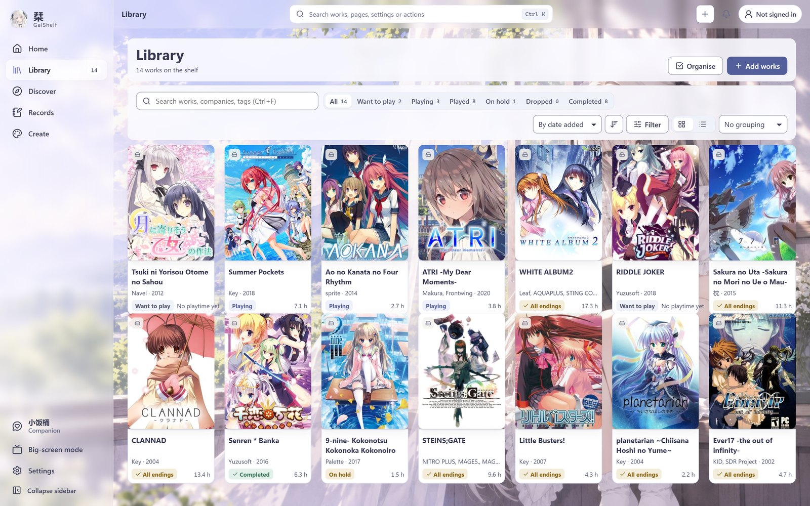</a>

> [!NOTE]
> **Version and screenshots**　The current release is [GalShelf 0.2.7](https://github.com/Harihi-Works/GalShelf-Dev/releases/tag/v0.2.7). The feature descriptions and demo screenshots below are retained from 0.2.6; version-specific instructions and limitations describe that release. See the 0.2.7 release notes for the latest interface and changes.
>
> **About the screenshots**　Everything shown comes from the released **GalShelf 0.2.6** client and a separate demo data set: titles and covers come from public databases, while every status, rating, playtime, play stub, review and reading note was written for the demo and belongs to no real user.
>
> The screenshots use **Illustration: Off**, so there is no companion portrait; the companion button in the lower-left corner still works. The in-game pictures show a demo window made from GalShelf's own artwork, not a scene from any commercial game; the game-menu picture joins two real window captures — the demo window and the game menu — at their actual on-screen positions over a plain background.

---

## 📚 Library: bring order to the games on your drive

Pick a games folder and GalShelf compares every subfolder with VNDB and other sources (only titles are sent). Each result is marked **High confidence**, **Review** or **Not identified**, with candidate works and the main game program — nothing is written to your shelf until you confirm. You can also import the games from your local Steam library, or add works by hand.

Once they are on the shelf, filter by status, group by company, collection or Steam series, and find any title, original title or company instantly. Turn on **Organise** to select several works at once and change their status, add them to a collection or move them to the recycle bin.

<table>
<tr>
<td width="50%"><a href="assets/screenshots/en/import.jpg">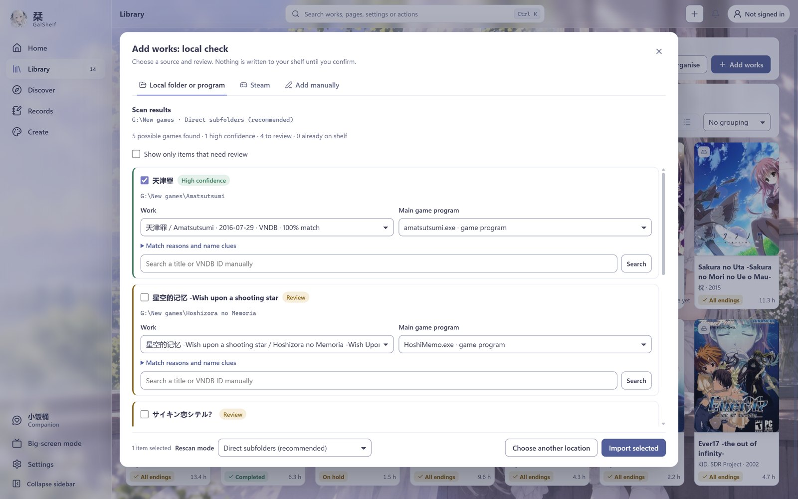</a></td>
<td width="50%"><a href="assets/screenshots/en/organize.jpg">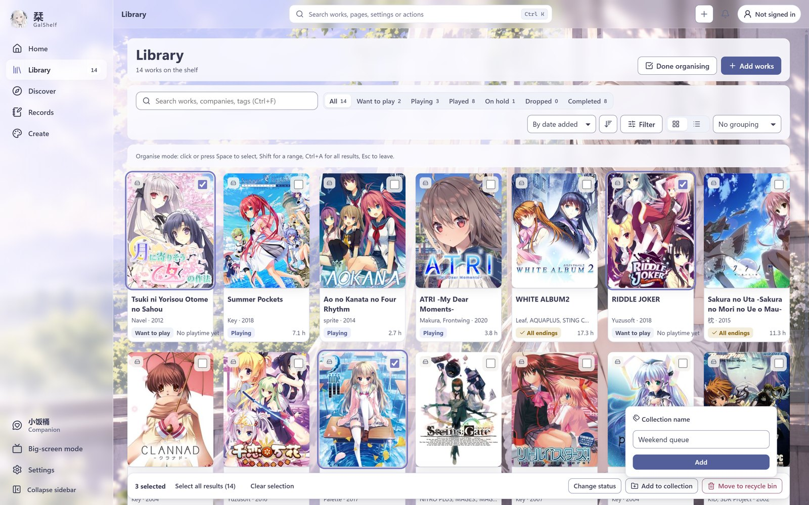</a></td>
</tr>
<tr>
<td><sub><b>Check before importing</b> — five folders found: one high-confidence match, four waiting for you to confirm the work and program. In the candidate list, GalShelf shows VNDB's Simplified Chinese title first when one exists, even in the English interface.</sub></td>
<td><sub><b>Organise mode</b> — three works selected, about to go into a new collection, “Weekend queue”.</sub></td>
</tr>
</table>

## 🎮 In game: tools right beside the game window

Games launched from GalShelf are timed automatically. While a game runs, press <kbd>Ctrl</kbd>+<kbd>Alt</kbd>+<kbd>G</kbd> (changeable in Settings) and the game menu opens next to the game window: screenshots and screenshot history, window opacity and always-on-top, Magpie scaling, controller-to-keyboard mapping and the timing mode, all in one place.

A screenshot freezes the current frame and opens the editor right over the game window: crop, mosaic, upscale, erase and cut out — and recognise the dialogue on your PC with Windows' built-in OCR. Recognition can make mistakes, so you check the text and press 确认台词 (confirm dialogue); the screenshot and the line then go to the share card together.

<a href="assets/screenshots/en/game-menu.jpg">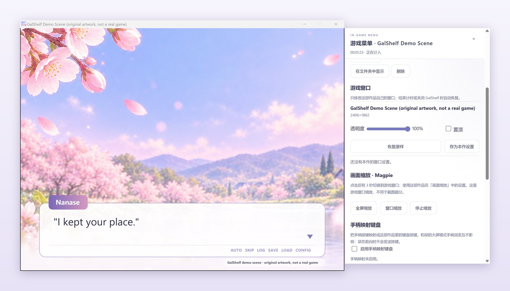</a>

<sub><b>Game menu</b> — the 0.2.6 game menu beside the demo scene while it is being timed: window opacity and always-on-top, Magpie scaling and controller-to-keyboard mapping; scroll up for screenshots and their history.</sub>

<table>
<tr>
<td width="50%"><a href="assets/screenshots/en/screenshot-editor.jpg">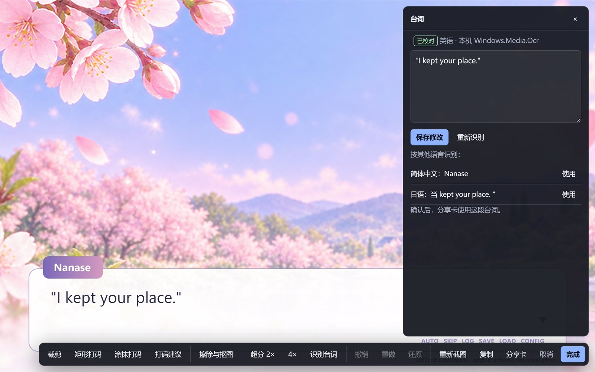</a></td>
<td width="50%"><a href="assets/screenshots/en/share-card-dialogue.jpg">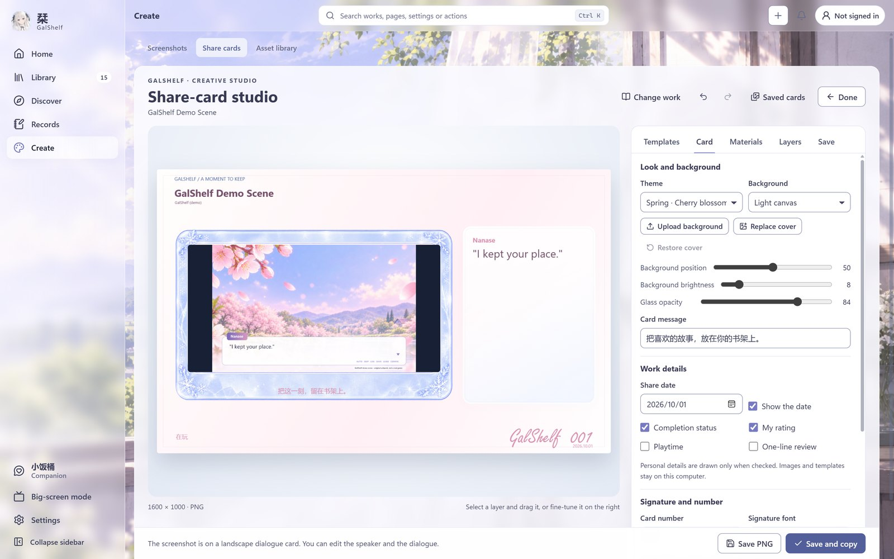</a></td>
</tr>
<tr>
<td><sub><b>Screenshot editor</b> — the recognised line is checked and marked as confirmed; the toolbar holds crop, mosaic, upscale and the other tools.</sub></td>
<td><sub><b>On to a share card</b> — the screenshot and the line are placed on a landscape dialogue card; the speaker and the line stay editable.</sub></td>
</tr>
</table>

<sub>In 0.2.6 the game menu and the screenshot editor are available in Chinese only, and the preset text on share cards (status, rating words, units, sample lines) and the layer names stay in Chinese; titles, reviews and dialogue appear as you wrote them.</sub>

## 🍡 Records: every story you played leaves a trace

Every work has **My record**: play status, Completed / All endings, a 0–10 dango rating, a short review, route and progress, and private notes. Each play session leaves a stub with its exact length; if you played on another PC, log the session by hand and its stub is marked **Manual**.

**Reading & routes** gathers the works you are reading or replaying: a one-line note of where you stopped, your next step, and the entry you last launched from. Come back after a few days and you know where to pick up.

<table>
<tr>
<td width="50%"><a href="assets/screenshots/en/record.jpg">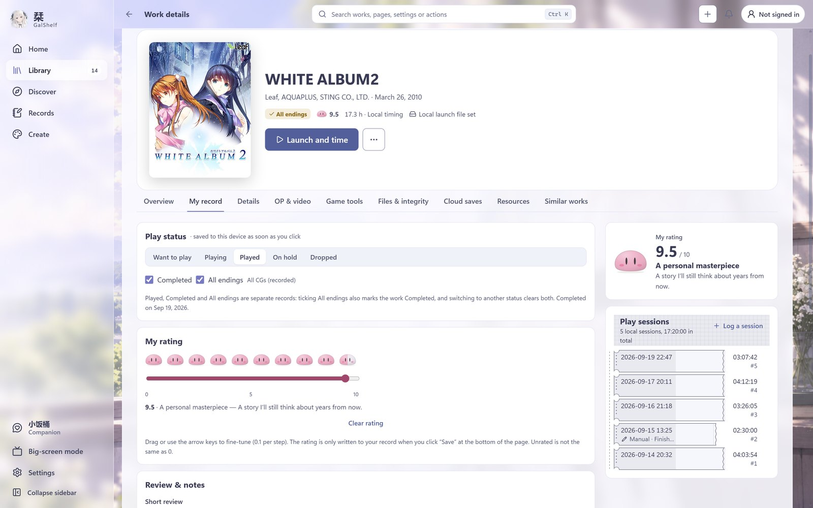</a></td>
<td width="50%"><a href="assets/screenshots/en/reading.jpg">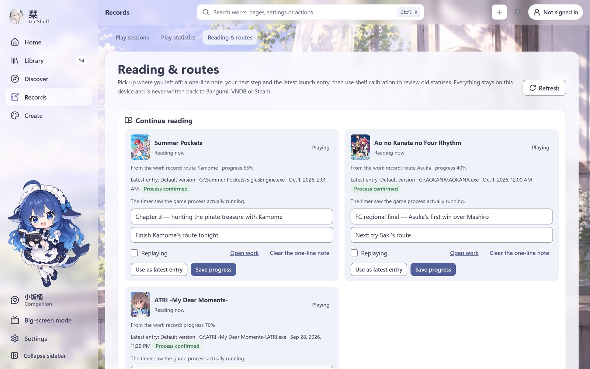</a></td>
</tr>
<tr>
<td><sub><b>My record</b> — <i>WHITE ALBUM2</i>: all endings, 9.5, five stubs totalling 17 h 20 min, one of them logged by hand.</sub></td>
<td><sub><b>Reading & routes</b> — three works in progress and one being replayed, each with where it stopped and what comes next.</sub></td>
</tr>
</table>

## 🎴 Share cards: show others the stories you love

Share cards read your record directly — status, dango rating, playtime and your one-line review — and lay it out in styles such as glass, sidebar, poster, ticket and journal. Every element on the card is a layer you can move, retype, restyle, hide or restack, and the result is exported as a 1400×1750 or 1600×1000 PNG.

<a href="assets/screenshots/en/share-card-ticket.jpg">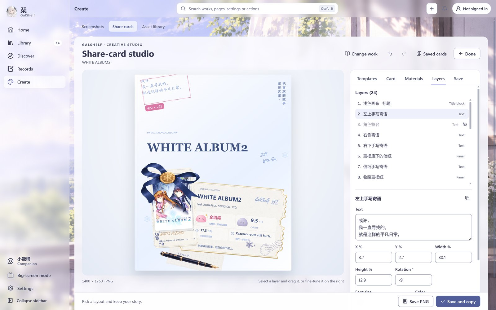</a>

<sub><b>Ticket layout</b> — all endings, 9.5, 17.3 h and the review on the card come from the same record; on the right, the handwritten line at the top left (左上手写寄语) is being edited, and the template's sample signature layer (角色签名) is hidden.</sub>

## 📺 Big-screen mode

Designed for TVs and controllers: move focus with the D-pad or stick, open details or change the status of the focused work, and continue your latest story with one press.

<p align="center"><a href="assets/screenshots/en/big-picture.jpg">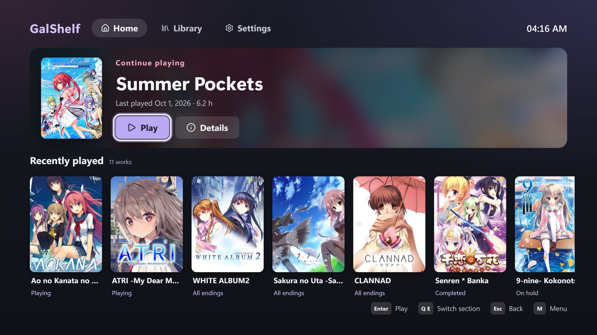</a></p>

---

## ✦ More features

<details>
<summary><b>☁ Cloud saves and shelf sync</b></summary>

<br>

Cloud saves and shelf sync are two different things: cloud saves back up your **game save files**; shelf sync only syncs your **records** (status, rating, completion, tags, short review, private notes, the date and length of each session and so on).

**Cloud saves**
- They work only for games linked to a VNDB work ID, and can be switched on or off per work. Once turned on in **Settings › Accounts & sync**, works whose save location you have confirmed are synced before launch and backed up after you quit; trusted, compatible missing saves are restored automatically.
- The cloud-save card on a work page has three actions: **Sync now** compares and syncs in the safe direction; **Upload backup** only saves this PC's progress; **Download / restore** only restores a specific cloud version, asks before replacing local saves that have changed, and keeps a local safety snapshot.
- If you play offline on two PCs and their saves diverge, both versions are kept and you choose which one to continue; ten versions are kept per work by default.
- **Where backups go**: the public package can use a sync folder (for example a local folder synced by your cloud-drive client). Direct Google Drive and OneDrive connections are implemented, but the app registrations they need are not shipped with the public package, so those services cannot be connected directly yet.
- Optional end-to-end encryption; a lost passphrase cannot be recovered. Without it, a sync folder is only as protected as your cloud drive and disk. When you turn cloud saves on, the dialog also offers three online options — fingerprint lookup, fingerprint contribution and showing backup status on your private website page — which you can untick.

**Shelf sync**
- Needs a [galshelf.com](https://galshelf.com) account and is turned on in **Settings › Accounts & sync**. The web shelf and the app merge field by field, offline changes are queued, and conflicts are resolved item by item.
- Sync is not a backup: deletions sync too. Game programs, folders, launch options and saves are never uploaded; the one-line notes and next steps in **Reading & routes** stay on this PC.

</details>

<details>
<summary><b>🛡 GalShelf Guard and work identification</b></summary>

<br>

- **GalShelf Guard** is an optional, separate program, currently a 0.1.0 pre-release beta: it has its own installer, is not code-signed, and Windows may ask for administrator approval when installing it. You can check for it, download, verify and install it from **Settings › Privacy & Security**.
- Guard records a trusted file list for each installed work, spots program files that were changed, removed or added, and analyses them with its own rules; suspicious files can be moved to a reversible quarantine or repaired from a verified local copy. Microsoft Defender is only an optional supplement.
- **A changed file is not the same as malware**: only a scanner's verdict marks something as a threat. Without Guard, the app itself still remembers the launch files you confirmed and warns you when they change.
- **Work identification** is anchored to the VNDB work ID and compares file SHA-256 values with a maintainer-signed fingerprint data set. A match only says which work a file belongs to; it says nothing about safety. The first maintainer data set has not been published yet, so 0.2.6 has no identification results from a data set. Online lookup and contribution are both optional; contributions are linked to your account and are not anonymous.

</details>

<details>
<summary><b>🛠 Launching and game tools</b></summary>

<br>

- A work's **Game tools** tab sets launch files, locale-emulated launch (Locale Emulator, for 32-bit programs only), Magpie scaling and window settings; timing can follow the foreground window, the running process, or the foreground window with recent input.
- The game menu opens only for the game GalShelf is currently timing. Screenshots are saved on your PC, and edits are saved as a new file without touching the original.
- Dialogue recognition uses Windows' built-in OCR, runs on your PC, and needs the Windows OCR component for the language (Chinese, Japanese or English).

</details>

<details>
<summary><b>🎨 Appearance, discovery and the companion</b></summary>

<br>

- Backgrounds can be an image, a GIF or an MP4 video, with adjustable focus, fit, opacity and blur. A work's **OP & video** tab plays or downloads OPs and trailers; videos start muted and pause while a game runs.
- **Discover** searches several sources at once; the release calendar tells VNDB-confirmed dates apart from announcements that only come from NextMoe; similar works are ranked by series, staff, developer and themes. Characters and birthdays need a galbd link in **Settings › Accounts & sync**; image search only sends the chosen picture after you press start.
- The companion in the lower-left corner can switch characters and portrait size, or be turned off completely in Settings.

</details>

---

<a id="en-companions"></a>

## Companion tools

These tools support GalShelf's library management and playing experience with identification data, file checks and save synchronisation. GalShelf itself is the main application described on this page, not a separate feature page, and players do not need every companion tool.

| Companion | Purpose | Text introduction |
| --- | --- | --- |
| **Galdex** | Maintainer-side collection, verification, review and signed publication of work fingerprints and save rules | [Fingerprints and rules](GALDEX.md#english) |
| **Galguard / GalShelf Guard** | Integrity checks, change warnings, reversible quarantine and repair from verified local copies | [Security and integrity](GALGUARD.md#english) |
| **Galdrive** | Standalone save backup, version history, multi-device sync, conflict handling and protected restoration | [Save backup and synchronisation](GALDRIVE.md#english) |

Core development of Galdex and Galdrive is substantially complete. Galdex remains an internal maintainer tool, and a standalone Galdrive download is not available yet; tool completion, data coverage and release acceptance are separate. These companion pages are text-only and do not change GalShelf's existing cloud saves or download availability.

---

<a id="en-install"></a>

## ⬇ Install

**You need** Windows 10 or 11 (64-bit) and the Microsoft Edge WebView2 Runtime (Windows 11 usually has it). No Python, Node.js or administrator rights are required.

1. Download `GalShelf-Windows-<version>.zip` from the [latest release](https://github.com/Harihi-Works/GalShelf-Dev/releases/latest), using the package and instructions for the release you select.
2. Extract the **whole** ZIP into a new folder and keep the `components` folder (aria2, Magpie, Locale Emulator, Real-ESRGAN) next to `GalShelf.exe`.
3. Start `GalShelf.exe`; the first launch shows a short bilingual welcome tour.

> [!TIP]
> GalShelf has no installer and the executable is not code-signed, so Windows SmartScreen may ask you to confirm once.
>
> Your shelf, settings and records live in `%LOCALAPPDATA%\GalShelf`, not in the program folder — to upgrade, extract the new version into a new folder and remove the old one once you're happy; both read the same data.

<a id="en-updates"></a>

## 🔏 Updates and verification

- GalShelf checks for updates by reading `latest.json` from the latest release in this repository (an update manifest with an embedded Ed25519 signature). An update is installed only when the manifest signature, the package size and its SHA-256 **all** match, and never while a game is running.
- `releases/v<version>/` keeps the manifest, checksums and release notes of every published version; `stable/latest.json` is a copy of the current release-channel manifest (`stable` is the channel directory name, not a declaration that beta testing has ended) and `stable/latest.json.sig` its detached signature, for checking by hand.
- Update manifests are signed with this public key (Ed25519, base64):

```
galshelf-update-2026-09: II1VyOQWGZphhHvY0bcjvqpuYkb1UjBmzb75h+VfuQc=
```

To check a download yourself, run this in PowerShell and compare the result with `SHA256SUMS.txt` in the same release:

```powershell
Get-FileHash .\GalShelf-Windows-<version>.zip -Algorithm SHA256
```

## 📜 Release history

Release notes for every version are on the [Releases](https://github.com/Harihi-Works/GalShelf-Dev/releases) page and in the [`releases/`](releases/) folder. Guides and FAQs live at [galshelf.com/docs](https://galshelf.com/docs).

<a id="en-open-source"></a>

## 🔓 Open-source policy

- **Current status**: GalShelf is undergoing phased beta testing and rapid development, and its own source code is not public yet. This repository currently provides announcements, documentation, screenshots, downloads and update-verification metadata; a public repository does not mean the application source has been open-sourced.
- **Next steps**: The source code will be opened when the stable release is ready. The source location, open-source license and contribution guidelines will be announced together at that time; no specific date has been set yet.
- **Third-party components**: Bundled open-source components retain their respective licenses; project links are listed under Credits and licenses below. GalShelf's source-release plans do not change those terms.

## 💐 Credits and licenses

- Work details and covers come from public databases such as [VNDB](https://vndb.org).
- Third-party components shipped in the package keep their own licenses: [aria2](https://github.com/aria2/aria2) (GPL-2.0), [Magpie](https://github.com/Blinue/Magpie) (GPL-3.0), [Locale Emulator](https://github.com/xupefei/Locale-Emulator) (LGPL-3.0) and [Real-ESRGAN-ncnn-vulkan](https://github.com/xinntao/Real-ESRGAN-ncnn-vulkan) (MIT).

<sub>Game titles and cover art shown in the screenshots belong to their respective owners and appear only to show the software's interface.</sub>
